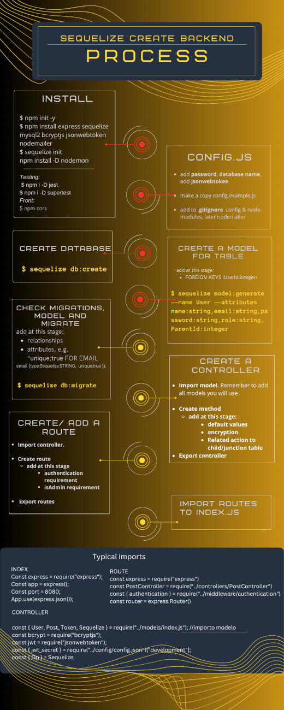

# Project E-commerce 🖥️ 🛒

## Description 📜 

The aim of the project was to create a backend for an imaginary online shop using **Node Js** and **Express** together with **MySQL** and **Sequelize**. A variety of REST APIs provide access to the data.


## Table of contents

- [Objectives](#objectives-)
- [Data modelling ](#data-modelling-)
- [Project architecture](#project-architecture-)
- [Controllers - observations](#controllers---observations-)
  - [Using user-supplied info to find items](#-using-user-supplied-info-to-find-items)
  - [Including associated tables](#-including-associated-tables)
  - [Using Sequelize operators:](#-using-sequelize-operators)
  - [Ordering results](#-ordering-results)
  - [Updating junction/associated tables:](#-updating-junctionassociated-tables)
- [Seeders - observations](#seeders---observations-)
- [Multer - investigation](#multer---investigation)
  - [Installation](#installation)
  - [Upload - middleware](#upload---middleware)
  - [Modifying ProductController](#modifying-productcontroller)
  - [Adding upload to the Route](#adding-upload-to-the-route)
- [Front](#front)
- [Tech](#tech-)
- [Author](#author-)

## Objectives 🎯

The obligatory requirements for completing the exercice consist of:

- [x] At least four tables with one-to-many and many-to-many associations (Users, Products, Categories, Orders) and a diagram to visualise the relations.
- [x] User registration and password encryption with **Bcrypt**
- [x] Login with **JSON Web tokens** and the use of middleware
- [x] A variety of CRUD endpoints
- [x] Data validation
- [x] Seeders to create data

Optional:

- [x]  Admin and Superadmin roles
- [x] Email confirmation on registration using **Nodemailer**  
- [x]  An extra table of Reviews associated to Products and Users  
- [x]  **Multer** to facilitate the uploading of images

Extras that I added:

- [x]  Extra endpoints to visualise data in different ways to consolidate the use of *inlude*, *through*, column aliases 
- [x] Front. A single page application as the user interface.


## Data modelling 🔄

I created a visual diagram of the database tables using MySQL Workbench: 


The database consists of 5 main tables: Users, Orders, Products, Categories and Reviews.

Table tokens is used for control purposes and is where session tokens are saved.  

Two junction tables define many-to-many relationships between categories and products, and products and orders. The latter has an extra column to record the quantity of each product in an order.

## Project architecture 🛠️

The organisation of folders and files becomes logical after a little practice, but for a first-timer it can look complex. Below is a breakdown of the program's file structure:


📁CONFIG 
- Defines my connection to the database in the development environment as well as password for authenticating tokens and using Nodemailer. The file is not uploaded to github; instead, an example template is uploaded.
Here we also have the file for Nodemailer.

📁CONTROLLERS 
- Code for different CRUD endpoints to interact with the database. Each table has its own file.

📁MIDDLEWARE 
- Authentication methods to check if a user is logged in (= has been issued a session token) or is an administrator. These checks are necessary to define actions that the user can perform with the database.

- Error handling: With Express, we can add a third parameter (req, res, **next**) to asynchronous functions and   "outsource" the handling of common errors to this middleware, which results in more efficient programming.

-Multer upload.js to define how file upload is handled.

📁MIGRATIONS 
- Migrations are instructions for and a track record of changes in the database. Table columns and their properties may be defined here before performing the migration, i.e. creating or modifying a table.

📁MODELS 
- As the name says, models store the table structure,associations and constraints. As the endpoint methods make reference to these models, the table associations (one-to-many, many-to-many...), properties (datatype, required data field...) and validations must be correctly recorded here. 

📁NODE_MODULES 
- Nodemodules is an automatically created folder by Node JS and is where packages are stored. The contents are not uploaded to github.

📁ROUTES 
- Routes define the crud method and url to perform actions with the database. Here we also define which actions may need additional authentication.

📁SEEDERS 
- Seeders are used to create bulk data for the database for testing purposes.

📄index.js 
- This is the file that handles the initialisation of the program and the local server.

📄package-lock.json & package.json 
- The dependencies I am using are listed here.

📄.gitignore 
- Gitignore controls files that contain information that should not be committed or uploaded.


Furthermore, I created an infograph of the basic steps for the creation and manipulation of tables to better grasp the process before starting: 



***

## Controllers - observations 🚧


### 🔎 Using user-supplied info to find items
Parameters - added to URL:  **findByPk** or  **where**-clause: 

```js
const user = await User.findByPk(req.params.id);
```
```js
const foundUser = await User.findOne({
                where: {
                    id: req.params.id
                }
                });
```
Using req.body - information typically from a form:

```js
const user = await User.findOne({
                where: { email: req.body.email }
            });
```


### ⛓️ Including associated tables

Include associated table:

```js
 const product = await Product.findAll({
                include: {
                    model: Review
                }
            });
```

Include an associated table, and another table associated with it:

```js
const categories = await Category.findAll({
                include: [{ model: Product, include: [{ model: Review }] }]
            });
```


Include an associated table through a junction table.
```js
     const orders = await Order.findAll({
                include: [{ model: Product, through: { model: Order_Product, }}]
            })
```


Including **Attributes** (array) allows us to specify which information to include and which to exclude: 
```js
const reviews = await Review.findAll({
                include: [{ 
                    model: Product, 
                    attributes: ["id", "name"]
                }, {
                    model: User,
                    attributes: ["id", "name", "surname", "email"]
                 }] 
            })
```

Specify the **attributes** array but leave it empty - we can exclude the data. In this case, junction table is necessary to access the category related to the product, but we don't want to see any data from the through-table:

```js
const foundProduct = await Product.findByPk(req.params.id, {
                include:  { 
                    model: Category, 
                    attributes:["name"], 
                    through: { attributes: [] } //Excludes data from the junction table
                 }
            }) 
```

By adding another item in the attributes array, we can specify an **alias** for the data:

```js
attributes: [["id", "Order ID"]], //second value is alias
```


### 🔣 Using Sequelize operators:
Import **Sequelize** and add to model object:
```js
const { Op } = Sequelize; 
const { Category, Product, Category_Product, Review, Sequelize } = require("../models/index.js");
```

```js
...
    const category = await Category.findAll({
        where: {
            name: { [Op.like]: `%${req.params.name}%` }
        }
    })
```

```js
    const products = await Product.findAll({
        where: {
            price: { [Op.between]: [(+req.params.price - 50), (+req.params.price + 50)] } //RANGE +- fifty 
                }
            });
```

### ↕️ Ordering results
```js
 const products = await Product.findAll({
                order: [   
                    ["price", "DESC"], //Array inside array
                ], 
            })
```

### ⛓️ Updating junction/associated tables:

Sequelize provides an easy way to modify associations while modifying the main table.
With **add-** and **set-** methods, it is possible to pass an **array** to pass more than one value

Postman body (JSON):
```json
{
"name": "Tambourine",
"price": 25,
"description": "Real wood",
"CategoryId": [1, 4]
}
```

```js
const product = await Product.create(req.body);
product.addCategories(req.body.CategoryId); //addCategories creates entry to junction table
```

```js
await foundProduct.update(req.body);
foundProduct.setCategories(req.body.CategoryId); //setCategories updates junction table
```


In theory, Sequelize provides a way to delete associations by adding the following line to the Model:

```js
Product.hasMany(models.Review, { onDelete: "cascade" }),
```
However, in practice, **this does not appear to work**. It seems other programmers have faced similar issues. Therefore, the deletion of associations must be defined in the controller.

```js
await Product.destroy({where: {id: req.params.id}})           
await Review.destroy({where: {ProductId: req.params.id}});  //Delete from junction table
```

Currently, deletions of associated tables still need to be reviewed in the project.


***

## Seeders - observations 🚜

All the tables have a number of seeder files to populate the tables. User passwords have been encrypted in seeders too.

The seeders should be used together on an empty database to make sure foreign keys (ids) coincide logically.

It would be useful to seed junction tables with parent table seeder, but this is not possible with Sequelize **bulkInsert**.

```js
 async up (queryInterface, Sequelize) {
    return queryInterface.bulkInsert ( "Users", [
      {
      email: "testadmin@example.co",
      name: "Andy",
      surname: "Administrator",
      password: bcrypt.hashSync("1234", 10), 
      role:"admin",
      confirmed: true,
      createdAt: new Date(),
      updatedAt: new Date()
    },
    ...
```

***


## Multer - investigation ⬆️

Multer is a node.js middleware for handling multipart/form-data , w used for uploading files. Apart from the [Official documentation](https://www.npmjs.com/package/multer), the following tutorial and related github was helpful: [Youtube: Image / File Upload On Node Sequelize Rest API.](https://www.youtube.com/watch?v=sVYrH166LXM)

### ⚒️ Installation
```bash
$ npm install --save multer
```

### 💾 Handling upload

I saved image upload code in the middleware folder.

```js
const multer = require("multer");
const path = require("path")
```

The following code defines where the file should be stored.
```js
const storage = multer.diskStorage({
    destination: function (req, file, cb) {
        cb(null, "./uploaded_imgs/")
    },
    filename: function (req, file, cb) {
        cb(null, file.originalname)
      }
  })
```
* **file.originalname** is an inbuilt property of the file object provided by multer, and includes the file extension.

The following code defines what happens on file upload:
```js
const upload = multer({
    storage: storage,
    limits: { fileSize: '2000000' }, 
    fileFilter: (req, file, cb) => { 
        const fileTypes = /jpeg|jpg|png|/ 
        const mimeType = fileTypes.test(file.mimetype) 
        const extname = fileTypes.test(path.extname(file.originalname)) 

        if(mimeType && extname) {
            return cb(null, true)  
        }
        cb("File format not accepted") 
    }
})

module.exports = upload;

```
* Image size is limited to 2MB.

* **fileFilter** function is used to define accepted filetypes.

* Accepted types are defined with a regular expression.

* We check the uploaded file's MIMEtype using JavaScript Regular Expression **test()** method. A MIME type consists of two parts: a "type" and a "subtype", separated by a forward slash (/), e.g. image/jpeg. **file.mimetype** is an inbuilt property provided by Multer.

* **path.extname()** is a built-in function in the Node.js path module (imported on top!) that returns the extension of a file path -this is also checked.

* If both **mimeType** and **extname** return true, we return a multer callback with two values: **null** for the error argument (i.e. there is no error), and **true** for the second argument (i.e. the file is accepted). 

>__Warning__ Both MIMEtype and file extension are checked as MIME gives information about the real type of the file, while the extension is an indicator only and could be used to mask a different type of file.
Nevertheless, in the current project, we may assume a person with admin rights necessary to upload files won't try to upload harmful files.

### ⚙️ Modifying ProductController

Files must be passed through **form-data**. Req.body gathers all text input, while **req.file.path** determines the image path. **.path** is a property of the req.file object, provided by Multer.

```js
const product = await Product.create({...req.body, image: req.file.path});
```

The way to post data using Postman changes:
* Instead of **raw** and **json** object, we pass all the information as **form-data**, with image field set to **file**.  

* The CategoryIds to add data to the Categories_Products junction table must be specified as separate entries. However, adding square brackets after the key name [] results in the ids being gathered into one array, and they can be manipulated as an array in the code.


### 🛣️ Adding upload to the Route

In this case, the user can upload a single file. 

```js
router.post("/createProduct", authentication, isAdmin, upload.single("image"), ProductController.create);
```


***
## Front 🪟

I added a frontend with limited functionality:
* It displays products and responds to the different category/name search functions, showing the product, price, description and reviews, as well as calculating an average rating on the client side.
* It allows for login and logout, and displays the shopping cart that has been saved in the user's local storage. Products can be added or deleted from the cart.

Products are displayed as Bootstrap cards. Details and reviews are collapsibles that can be revealed on click.


Login, registration and cart (for logged-in users) are displayed on an offcanvas sidebar that can be opened by clicking the blue profile button.


On mobile devices, the cards occupy more horizontal space and the navbar stacks vertically.


On hover over product image, this lovely little css styling creates a zoom effect on the image: 

```css
.image-zoom {
    overflow: hidden;
  }
  
  .image-zoom img {
    transition: transform .5s ease;
    max-width: 100;
  }
  
  .image-zoom:hover img {
    transform: scale(1.5);
  }

```
***
## Tech 💻

Back:
* MySQL and MySQL Workbench
* Postman -for endpoint testing
* Node.JS
* Dependencies: 
  * express
  * mysql2
  * sequelize
  * jsonwebtoken
  * bcryptjs
  * nodemailer
  * nodemon
  * cors - to access server from the html front 

Front:
* HTML, JavaScript - no frameworks
* CSS, Bootstrap 5
* AXIOS

## Author ♣️

* Kbastamow
 